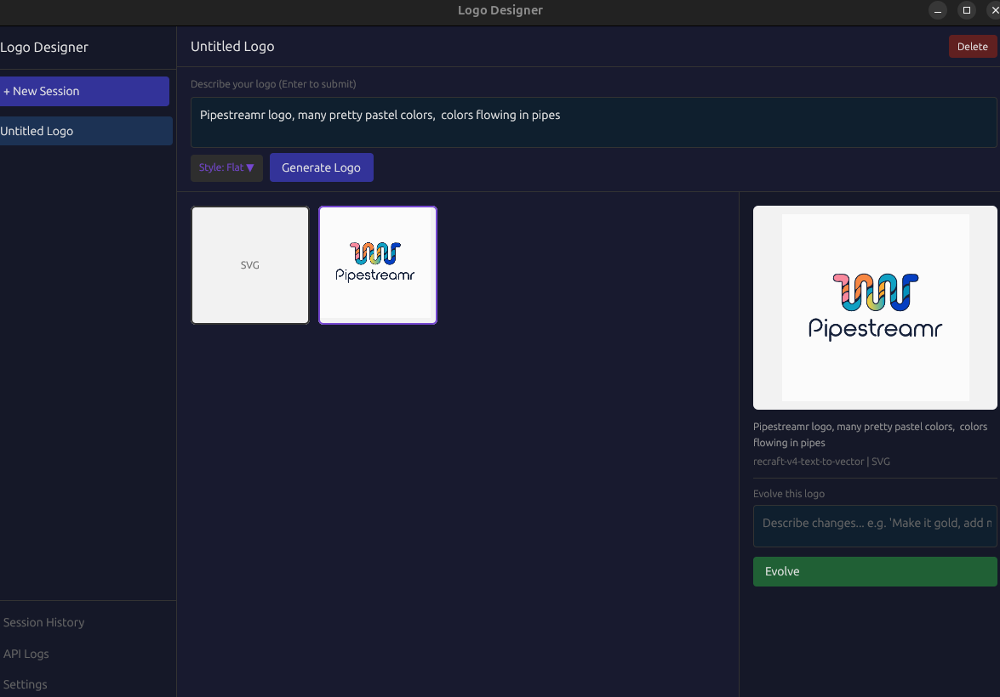

# Logo Designer

A native desktop application for AI-powered logo design, built with Rust and [GPUI](https://github.com/zed-industries/zed/tree/main/crates/gpui).

Generate vector logos from text prompts, iterate on designs with AI-driven evolution, and export production-ready SVG or PNG files — all from a fast, local-first interface.



## Features

- **Text-to-Vector Logo Generation** — Describe your logo and get SVG output via [Recraft V4](https://fal.ai/)
- **Logo Evolution** — Select a generated logo and refine it with natural language instructions using FLUX Pro Kontext
- **Multiple Styles** — Flat, Line Art, Cartoon, Linocut, Doodle, and Engraving
- **Session Management** — Organize designs into named sessions with full history
- **SVG & PNG Export** — Export logos directly to your desktop
- **API Logs** — Inspect every request and response for debugging
- **Local Storage** — All images and data stored locally in SQLite

## Tech Stack

- **Rust** (Edition 2024) with **GPUI** for the UI
- **FAL AI** APIs for image generation
- **SQLite** (via rusqlite) for persistent storage
- **resvg** for SVG-to-PNG rendering

## Getting Started

### Prerequisites

- Rust toolchain (stable)
- A [FAL AI](https://fal.ai/) API key

### Build & Run

```bash
cargo run --release
```

On first launch, go to **Settings** and enter your FAL API key.

### Usage

1. Create a new session from the sidebar
2. Type a prompt describing your logo
3. Pick a style and click **Generate Logo**
4. Select a result, then use **Evolve** to refine it with follow-up instructions
5. Export as SVG or PNG when you're happy with the result

## License

MIT
